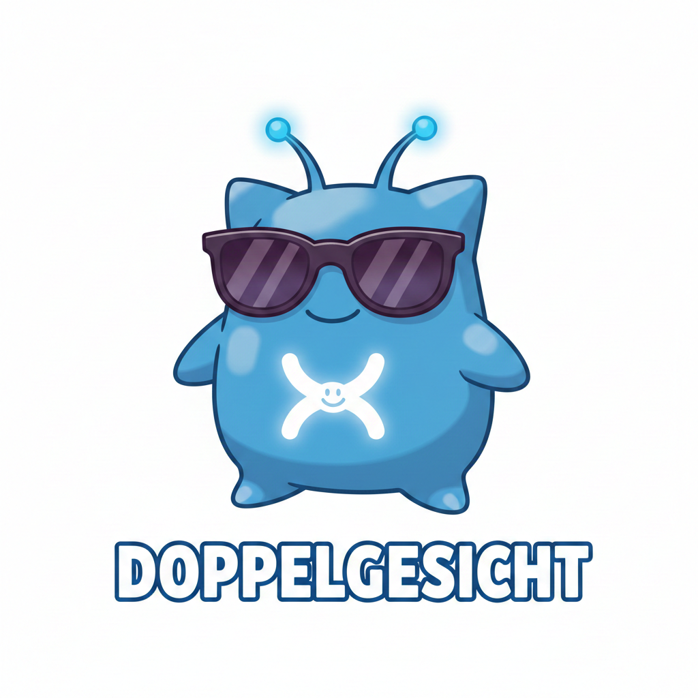
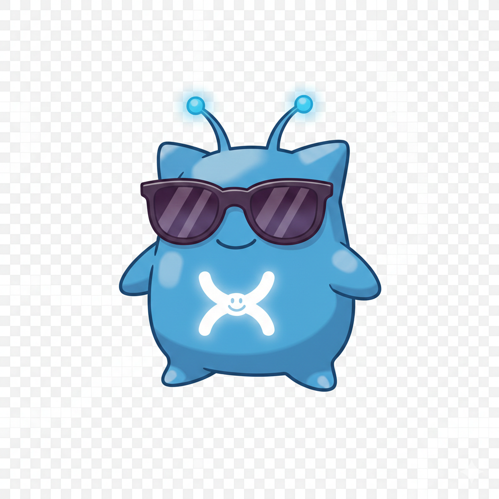

# doppelgesicht

<p align="center">
  
</p>

<p align="center">
  <strong>개인 AI 어시스턴트 플랫폼</strong><br>
  <em>로컬에서 실행하는 나만의 AI 비서 - 메신저와 브라우저로 제어</em>
</p>

<p align="center">
  <a href="#features">Features</a> •
  <a href="#installation">Installation</a> •
  <a href="#quick-start">Quick Start</a> •
  <a href="#architecture">Architecture</a> •
  <a href="#configuration">Configuration</a>
</p>

---

## Features

- **로컬 우선**: 개인 기기에서 실행, 데이터 프라이버시 보장
- **채널 통합**: Discord, Telegram, Slack 메신저 연동
- **다중 LLM**: Anthropic Claude, OpenAI, Moonshot(Kimi) 지원
- **도구 시스템**: 실시간 데이터 접근 (웹 검색, 파일 조작, 명령어 실행)
- **Web UI**: 브라우저에서 직접 설정과 대화
- **보안**: 암호화된 인증 정보, 도구 실행 승인 시스템

---

## Installation

```bash
# Clone the repository
git clone https://github.com/yourusername/doppelgesicht.git
cd doppelgesicht

# Install dependencies
npm install

# Build the project
npm run build

# Run initial setup
doppelgesicht onboard
```

### Requirements

- **Node.js**: >= 22.0.0
- **Package Manager**: npm or pnpm

---

## Quick Start

### 1. Initial Setup

```bash
# Run the onboarding wizard
doppelgesicht onboard

# This will:
# - Set up master password (AES-256-GCM encryption)
# - Configure LLM providers
# - Set up messaging channels (optional)
```

### 2. Start the Gateway

```bash
# Start the gateway server
doppelgesicht gateway

# The gateway will be available at:
# - HTTP API: http://localhost:8080
# - Web UI: http://localhost:8080/admin
# - WebSocket: ws://localhost:8080/ws
```

### 3. Chat with AI

**Via CLI:**
```bash
doppelgesicht agent
```

**Via Web UI:**
Open http://localhost:8080/admin/chat in your browser

**Via Discord/Telegram/Slack:**
Send a message to your configured bot after inviting it to a channel.

---

## Architecture

```
┌─────────────────────────────────────────────────────────────────┐
│                     Presentation Layer                          │
├─────────────────────────────────────────────────────────────────┤
│  CLI (Commander.js)         │   Web UI (Vanilla JS + Tailwind)  │
│  - onboard                  │   - Chat Interface                │
│  - gateway                  │   - Channel Settings              │
│  - agent                    │   - Agent Management              │
│  - message                  │   - Config Editor                 │
└─────────────────────────────────────────────────────────────────┘
                              │
                              ▼
┌─────────────────────────────────────────────────────────────────┐
│                        Gateway Layer                            │
├─────────────────────────────────────────────────────────────────┤
│  ┌──────────────┐  ┌──────────────┐  ┌──────────────┐           │
│  │   Auth       │  │   HTTP API   │  │  WebSocket   │           │
│  │   Manager    │  │   (Express)  │  │   Server     │           │
│  └──────────────┘  └──────────────┘  └──────────────┘           │
│  ┌──────────────┐  ┌──────────────┐  ┌──────────────┐           │
│  │ Tool Call    │  │   Cron Job   │  │   Config     │           │
│  │   Loop       │  │   Scheduler  │  │   Reloader   │           │
│  └──────────────┘  └──────────────┘  └──────────────┘           │
└─────────────────────────────────────────────────────────────────┘
                              │
                              ▼
┌─────────────────────────────────────────────────────────────────┐
│                       Agent System                              │
├─────────────────────────────────────────────────────────────────┤
│  LLM Clients                    │  Tool System                  │
│  ┌──────────┐ ┌──────────┐     │  ┌──────────┐ ┌──────────┐     │
│  │Anthropic │ │ OpenAI   │     │  │   exec   │ │web_fetch │     │
│  │ (Claude) │ │  (GPT)   │     │  │ (bash)   │ │ (HTTP)   │     │
│  └──────────┘ └──────────┘     │  └──────────┘ └──────────┘     │
│  ┌──────────┐ ┌──────────┐     │  ┌──────────┐ ┌──────────┐     │
│  │Moonshot  │ │ (More)   │     │  │browser   │ │file_*    │     │
│  │ (Kimi)   │ │          │     │  │(Playwright│ │(read/write│   │
│  └──────────┘ └──────────┘     │  └──────────┘ └──────────┘     │
│                                 │                               │
│  Auth Profiles                  │  Approval System              │
│  - Multi-provider               │  - Risk-based evaluation      │
│  - Fallback chains              │  - User approval UI           │
│  - Health checks                │  - Timeout handling           │
└─────────────────────────────────────────────────────────────────┘
                              │
                              ▼
┌─────────────────────────────────────────────────────────────────┐
│                       Channel Layer                             │
├─────────────────────────────────────────────────────────────────┤
│  ┌──────────┐ ┌──────────┐ ┌──────────┐                         │
│  │ Discord  │ │Telegram  │ │  Slack   │                         │
│  │  (Bot)   │ │  (Bot)   │ │  (App)   │                         │
│  └──────────┘ └──────────┘ └──────────┘                         │
└─────────────────────────────────────────────────────────────────┘
                              │
                              ▼
┌─────────────────────────────────────────────────────────────────┐
│                         Data Layer                              │
├─────────────────────────────────────────────────────────────────┤
│  ┌──────────────┐  ┌──────────────┐  ┌──────────────┐           │
│  │   Supabase   │  │   Local      │  │   Config     │           │
│  │  (Memory)    │  │   Cache      │  │   Files      │           │
│  └──────────────┘  └──────────────┘  └──────────────┘           │
└─────────────────────────────────────────────────────────────────┘
```

---

## Configuration

### Config File Structure

```yaml
# ~/.doppelgesicht/config.yaml
version: "2"

# LLM Configuration
llm:
  defaultProvider: moonshot
  defaultModel: moonshot-v1-8k
  maxTokens: 4096
  temperature: 0.7

# Channel Configuration
channels:
  enabled: true
  discord:
    enabled: true
    botToken: ${DISCORD_BOT_TOKEN}
    allowedUsers: []
    allowedChannels: []
    allowDMs: true
  telegram:
    enabled: false
    botToken: ${TELEGRAM_BOT_TOKEN}
    allowedUsers: []
  slack:
    enabled: false
    appToken: ${SLACK_APP_TOKEN}
    botToken: ${SLACK_BOT_TOKEN}

# Gateway Configuration
gateway:
  httpPort: 8080
  wsPort: 8081
  host: "127.0.0.1"
  cors:
    origins: ["http://localhost:3000"]
  auth:
    jwtSecret: ${JWT_SECRET}
    tokenExpiry: 3600

# Memory Configuration
memory:
  maxContextLength: 10
  supabase:
    url: ${SUPABASE_URL}
    anonKey: ${SUPABASE_ANON_KEY}

# Security Configuration
security:
  approvalMode: interactive
  timeouts:
    low: 30
    medium: 60
    high: 120
    critical: 120
```

### Environment Variables

| Variable | Description | Required |
|----------|-------------|----------|
| `DISCORD_BOT_TOKEN` | Discord bot token | For Discord |
| `TELEGRAM_BOT_TOKEN` | Telegram bot token | For Telegram |
| `SLACK_APP_TOKEN` | Slack app-level token | For Slack |
| `SLACK_BOT_TOKEN` | Slack bot token | For Slack |
| `ANTHROPIC_API_KEY` | Anthropic API key | For Claude |
| `OPENAI_API_KEY` | OpenAI API key | For GPT |
| `MOONSHOT_API_KEY` | Moonshot API key | For Kimi |
| `SUPABASE_URL` | Supabase project URL | For memory |
| `SUPABASE_ANON_KEY` | Supabase anon key | For memory |

---

## CLI Commands

### Core Commands

```bash
# Initial setup wizard
doppelgesicht onboard

# Start the gateway server
doppelgesicht gateway

# Interactive chat with AI
doppelgesicht agent

# Send test message to channel
doppelgesicht message send --channel <id> --text "Hello"

# Manage configuration
doppelgesicht config get <path>
doppelgesicht config set <path> <value>
doppelgesicht config edit

# Browser automation
doppelgesicht browser open <url>
doppelgesicht browser execute <script>
```

### Cron Job Commands

```bash
# List scheduled jobs
doppelgesicht cron list

# Add a new job
doppelgesicht cron add --name "daily-report" --schedule "0 9 * * *" --command "curl ..."

# Run job immediately
doppelgesicht cron run <id>

# View job logs
doppelgesicht cron logs <id>
```

---

## Web UI

The Web UI provides a browser-based interface for managing your AI assistant:

| Page | URL | Description |
|------|-----|-------------|
| **Chat** | `/admin/chat` | Real-time AI conversation |
| **Channels** | `/admin/control/channels` | Discord/Telegram/Slack settings |
| **Cron Jobs** | `/admin/control/cron` | Scheduled task management |
| **Agents** | `/admin/agent/agents` | LLM profile configuration |
| **Skills** | `/admin/agent/skills` | Custom skill management |
| **Config** | `/admin/settings/config` | Configuration editor |
| **Logs** | `/admin/settings/logs` | Real-time log streaming |

---

## Tool System

Doppelgesicht provides tools for AI to access real-time data:

| Tool | Description | Risk Level |
|------|-------------|------------|
| **exec** | Execute shell commands | Critical |
| **web_fetch** | HTTP requests to URLs | High |
| **browser** | Playwright browser automation | Critical |
| **file_read** | Read local files | High |
| **file_write** | Write to local files | Critical |
| **channel_send** | Send messages to channels | Medium |

### Tool Call Flow

```
User Message
    │
    ▼
LLM decides to use tool
    │
    ▼
Risk evaluation
    │
    ├── Low/Medium → Auto-execute
    │
    └── High/Critical → Request approval
            │
            ▼
    User approves/denies
            │
            ▼
    Tool executes
            │
            ▼
    Result sent to LLM
            │
            ▼
    Final response
```

---

## Security

### Authentication

- **Master Password**: Argon2id-based key derivation
- **Credential Encryption**: AES-256-GCM for all stored API keys
- **JWT Tokens**: For API and WebSocket authentication
- **Session Management**: Configurable token expiry

### Tool Execution Security

- **Risk Classification**: Automatic risk level assessment
- **User Approval**: Required for high/critical risk tools
- **Execution Limits**: Timeout and output size limits
- **Audit Logging**: All tool executions logged

### Network Security

- **Localhost Binding**: Gateway defaults to 127.0.0.1
- **CIDR ACL**: IP-based access control
- **CORS**: Configurable allowed origins
- **Rate Limiting**: Per-IP and per-user request limits

---

## Development

### Project Structure

```
doppelgesicht/
├── src/
│   ├── cli/                    # CLI commands
│   │   └── commands/
│   │       ├── onboard.ts
│   │       ├── gateway.ts
│   │       ├── agent.ts
│   │       └── ...
│   ├── gateway/                # Gateway server
│   │   ├── server.ts
│   │   ├── auth.ts
│   │   └── admin/              # Web UI static files
│   ├── llm/                    # LLM clients
│   │   ├── anthropic.ts
│   │   ├── openai.ts
│   │   ├── moonshot.ts
│   │   └── types.ts
│   ├── channels/               # Channel adapters
│   │   ├── discord/
│   │   ├── telegram/
│   │   └── slack/
│   ├── tools/                  # Tool system
│   │   ├── bash/
│   │   ├── browser/
│   │   └── approval/
│   ├── core/                   # Core utilities
│   │   ├── config-manager.ts
│   │   └── auth-profile.ts
│   ├── memory/                 # Memory system
│   │   └── supabase/
│   ├── security/               # Security utilities
│   │   ├── crypto.ts
│   │   └── keychain.ts
│   └── logging/                # Logging system
├── docs/                       # Documentation
│   └── PRD.md
├── img/                        # Images and logos
└── package.json
```

### Build

```bash
# Development build
npm run build

# Watch mode
npm run dev

# Run tests
npm test
```

---

## License

MIT License - Free to use and modify

---

## Acknowledgments

- Inspired by [OpenClaw](https://github.com/small-goliath/openclaw)
- Built with [Claude Code](https://github.com/anthropics/claude-code)

---

<p align="center">
  
  <br>
  <em>Your personal AI assistant</em>
</p>
